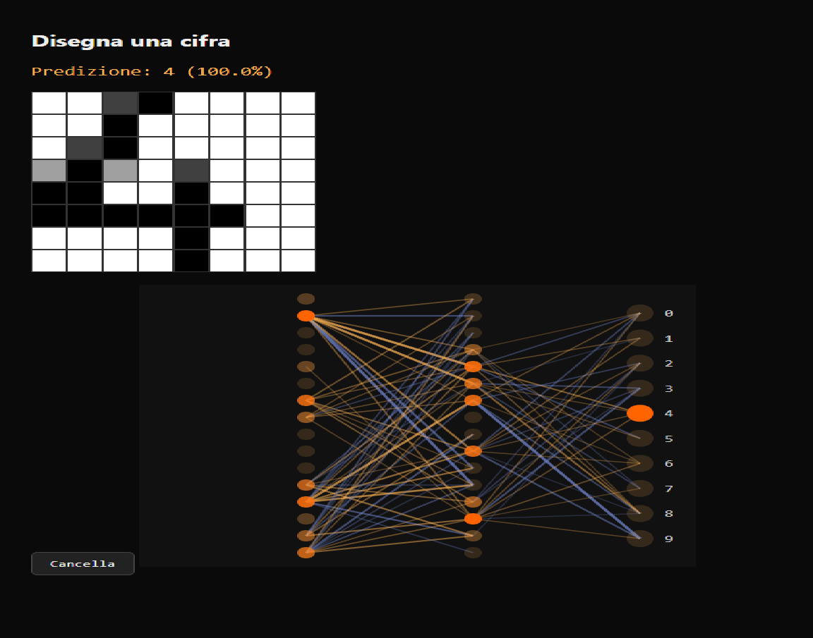

# Neural Network Visualizer

A tiny neural network (64 → 16 → 16 → 10) that recognizes hand-drawn digits, with every activation and connection rendered live as you draw — right in the browser, no backend required.

**[Live demo](https://aiellogabri05-glitch.github.io/neural-network-visualizer/)** — link added after deploy



## How it works

Draw a digit on the 8×8 grid and watch the network think in real time:

- The grid **is** the input layer — 64 pixels feeding directly into the network
- Hidden neurons light up in orange proportional to their activation
- Connections between layers show only the strongest current contributions (source activation × weight), colored by sign — orange for excitatory, blue for inhibitory
- The output layer shows live probabilities for each digit (0–9), with the top prediction highlighted

## Architecture

- **Training** (Python): a scikit-learn `MLPClassifier` (2 hidden layers of 16 neurons, ReLU activation) trained on the `digits` dataset (1,797 8×8 handwritten digit images), reaching **96.7% test accuracy**
- **Inference** (JavaScript): the trained weights are exported to JSON and the forward pass — matrix multiplication, ReLU, softmax — is reimplemented from scratch in vanilla JS, so the whole demo runs client-side with zero ML libraries in the browser
- **Visualization**: plain SVG, updated on every stroke — no charting library

## Stack

Python (scikit-learn, numpy) for training · Vanilla JavaScript + SVG for inference and visualization · No frameworks, no backend

## Run locally

```bash
git clone https://github.com/aiellogabri05-glitch/NOME-REPO.git
cd NOME-REPO
# open index.html with a local server (e.g. VS Code Live Server)
```

## Retrain the model

```bash
pip install scikit-learn numpy
python train.py   # regenerates weights.json
```